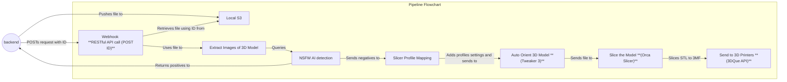

# Legacy n8n Pipeline

The pipeline receives print jobs from the backend and is responsible for automated preprocessing of 3D prints, vetting and safety checks (whether the print is 
appropriate) before being actually sent to the printers. Processing scripts include auto orient, image extraction for NSFW AI vision model checks and slicing.

The current pipeline uses a self hosted docker container of an n8n instance to execute a linear workflow for the vetting process for ensure the STL files are safe and printable,
before actually sending them to the 3DQue printers via the 3DQue API, which is also locally hosted.

# Pipeline Flowchart 



# Workflow 

## Backend Integration Contract (n8n API)

Reference: `docs/n8n_integration_api.md`

Base path for callbacks from the pipeline to backend:

- `/api/v1/integrations/n8n`

Required auth header for every callback:

- `X-Service-Token: <opaque_token>`

Standard backend response envelope:

```json
{
  "success": true,
  "data": {}
}
```

Standard error envelope:

```json
{
  "success": false,
  "error": {
    "code": "ERROR_CODE",
    "message": "Human-readable message",
    "details": {}
  }
}
```

ID contract:

- `jobId` (UUID): backend-owned print job ID
- `executionId` (string): n8n/windmill execution ID
- Pipeline callbacks must include the same `executionId` after start to avoid `409 EXECUTION_ID_CONFLICT`

## 0) Payload Into Pipeline (Backend -> pipeline trigger)

The n8n integration API doc defines callback endpoints (pipeline -> backend), not the trigger payload schema itself.

For this pipeline, treat these as required minimum inputs at ingest time:

```json
{
  "jobId": "550e8400-e29b-41d4-a716-446655440000",
  "file": {
    "storageKey": "print-jobs/42/input/model.stl"
  }
}
```

Common metadata fields used by pipeline steps (when provided):

- `title`
- `description`
- `category`
- `formAnswers.purpose`
- `formAnswers.design_intent`

## Pipeline -> Backend Callbacks (Current)

### 1) Mark execution started

Endpoint:

- `POST /api/v1/integrations/n8n/jobs/{jobId}/started`

Body:

```json
{
  "executionId": "123456",
  "workflowKey": "DEFECT_SCAN_V1",
  "startedAt": "2026-01-13T17:21:33.120Z"
}
```

### 2) Mark execution complete (success)

Endpoint:

- `POST /api/v1/integrations/n8n/jobs/{jobId}/complete`

Body:

```json
{
  "executionId": "123456",
  "finishedAt": "2026-01-13T17:25:55.000Z",
  "result": {
    "resultRef": "s3://bucket/orders/42/output.json",
    "summary": {
      "defectsFound": 3
    }
  }
}
```

### 3) Mark execution failed

Endpoint:

- `POST /api/v1/integrations/n8n/jobs/{jobId}/failed`

Body:

```json
{
  "executionId": "123456",
  "finishedAt": "2026-01-13T17:24:01.000Z",
  "error": {
    "code": "MODEL_ERROR",
    "message": "Out of memory"
  }
}
```

### 4) Manual termination sync

Endpoint:

- `POST /api/v1/integrations/n8n/jobs/{jobId}/terminated`

Body:

```json
{
  "executionId": "123456",
  "terminatedAt": "2026-01-13T18:01:10.000Z",
  "reason": "Manually stopped in n8n UI"
}
```

### 5) Result file upload handshake

Request upload URL:

- `POST /api/v1/integrations/n8n/jobs/{jobId}/presigned-upload`

```json
{
  "executionId": "123456",
  "fileName": "processed_model.stl",
  "fileSize": 3457600,
  "contentType": "model/stl"
}
```

Confirm upload:

- `POST /api/v1/integrations/n8n/jobs/{jobId}/confirm-upload`

```json
{
  "executionId": "123456",
  "fileId": "550e8400-e29b-41d4-a716-446655440000",
  "checksum": "a3b2c1d4e5f6789012345678901234567890123456789012345678901234abcd"
}
```

## Deferred Endpoints For Windmill Migration (Not Used Right Now)

Because slicing currently completes in milliseconds, cooperative polling/reporting is intentionally deferred:

- Do not use `POST /api/v1/integrations/n8n/jobs/{jobId}/progress`
- Do not use `GET /api/v1/integrations/n8n/jobs/{jobId}/status?executionId=...`
- Do not use `POST /api/v1/integrations/n8n/jobs/{jobId}/canceled`

If slicing time increases, re-enable cooperative cancellation and periodic progress updates.

